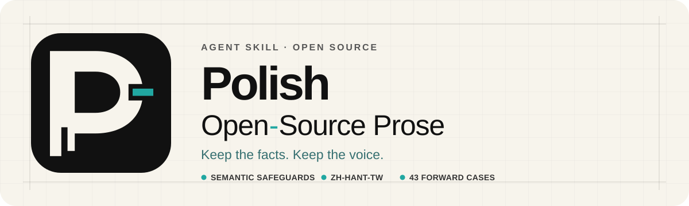

<p align="center">
  
</p>

<p align="center">
  <a href="README.zh-Hant-TW.md">繁體中文</a>
  ·
  <a href="#quick-start">Quick start</a>
  ·
  <a href="#locale-support">Locale support</a>
  ·
  <a href="CONTRIBUTING.md">Contributing</a>
</p>

<p align="center">
  <a href="https://github.com/ting-hong-shieh/polish-open-source-prose/actions/workflows/validate.yml"></a>
  
  
  
  
</p>

> An agent skill for making public project prose less generic or AI-sounding without
> treating a blacklist or detector score as a style guide. It protects the facts,
> limits, commands, and project voice that open source depends on—and turns PR or issue
> verification requests into reproducible review evidence. Runs on Claude Code and
> Codex.

<table>
  <tr>
    <td width="33%">
      <strong>OSS facts stay intact</strong><br>
      Protect facts, numbers, versions, conditions, negation, attribution, causality,
      commands, links, quotations, and markup.
    </td>
    <td width="33%">
      <strong>Review evidence is reproducible</strong><br>
      Anchor before/after traces to commits, show raw output, and state what the
      comparison does and does not cover.
    </td>
    <td width="33%">
      <strong>Locales stay specific</strong><br>
      Use regional terminology and false-positive guards instead of a universal
      replacement list.
    </td>
  </tr>
</table>

## For PR and issue follow-ups

When a reviewer asks for a trace, benchmark, or before/after comparison, use the skill
to produce an evidence response with:

- the exact base and head commits;
- the same test or translation path, fixture, and configuration for both states;
- raw output before interpretation; and
- the environment, comparison rule, covered scope, excluded cases, and final-head CI
  status.

The skill does not invent test output or prove a patch correct. It helps turn the
evidence available in the repository into a response a reviewer can reproduce.

## For text that lands in another repository

Before drafting a pull request body, issue report, commit message, or changelog entry
for a target project, the skill reads that project's own rules: `CONTRIBUTING.md`, the
pull request and issue templates, the commit convention, any DCO or CLA requirement,
and the changelog format. Sources it cannot read are named rather than treated as
absent rules. Required sections, checklist items, sign-off trailers, and commit
prefixes are protected the same way Markdown structure is protected, and a missing
field is answered in the project's wording instead of being deleted.

The skill does not check a contributor agreement box, add a sign-off for an identity it
cannot verify, or mark a verification item as done. When a requested edit conflicts with
the project's required format, it reports the conflict instead of normalizing the text.

## Quick start

The skill directory follows the [Agent Skills](https://agentskills.io) format, so the
same files work in Claude Code and Codex.

### Install with Claude Code

Add this repository as a plugin marketplace, then install the plugin:

```text
/plugin marketplace add ting-hong-shieh/polish-open-source-prose
/plugin install polish-open-source-prose
```

To install the skill without the plugin system, copy the directory instead:

```bash
git clone https://github.com/ting-hong-shieh/polish-open-source-prose.git
cp -r polish-open-source-prose/skills/polish-open-source-prose ~/.claude/skills/
```

Use `.claude/skills/` in a project instead of `~/.claude/skills/` to scope the skill to
that repository.

### Install with Codex

Invoke `$skill-installer` and ask:

> Install the `polish-open-source-prose` skill from this repository's
> `skills/polish-open-source-prose` directory:
> `https://github.com/ting-hong-shieh/polish-open-source-prose/tree/main/skills/polish-open-source-prose`

You can also use the skill folder directly during local development:

```text
skills/polish-open-source-prose
```

### Invoke the skill

Claude Code loads the skill automatically when a request matches its description. To
invoke it directly:

```text
/polish-open-source-prose
```

In Codex:

```text
$polish-open-source-prose
```

Try one of these requests:

```text
Audit this README and propose only evidence-backed edits.

Localize these release notes for zh-Hant-TW without changing product behavior.

Review this PR description for unsupported claims and lost qualifications.
```

## Before and after

These examples come from the current
[forward-case corpus](skills/polish-open-source-prose/tests/forward_cases.json).
They show both kinds of decisions the skill makes: replacing vague prose with a
verified behavior, and leaving clear technical text unchanged.

### Replace promotion with behavior

**Surface:** README · **Mode:** rewrite

Before:

> PolyglotGuard is a powerful, next-generation solution that seamlessly protects your multilingual codebase across today's rapidly evolving ecosystem.

After:

> PolyglotGuard checks pull requests for translated strings that alter commands, links, or placeholders.

Why: The revision removes unsupported promotion and keeps the observable check.

### Remove hype without changing behavior in `zh-Hant-TW`

**Surface:** README · **Locale:** `zh-Hant-TW` · **Mode:** rewrite

Before:

> PolyglotGuard 是一款革命性的工具，全面賦能開發團隊，讓每個 pull request 都更有品質。它會檢查翻譯是否改動命令、連結或預留位置。

After:

> PolyglotGuard 會在 pull request 中檢查翻譯是否改動命令、連結或預留位置。

Why: The Taiwan-locale case keeps the product name, command-related terms, and
behavior while removing generic claims; it does not translate technical identifiers
mechanically.

### Keep clear technical prose unchanged

**Surface:** README · **Mode:** keep

Before:

> The checker reads `.polyglotguard.yml`, then groups files by locale. Without a config file it falls back to built-in rules but does not create one automatically.

After:

> The checker reads `.polyglotguard.yml`, then groups files by locale. Without a config file it falls back to built-in rules but does not create one automatically.

Why: The paragraph names the configuration file, processing order, fallback, and
negative guarantee. Rewriting it would risk losing a constraint without adding clarity.

These corpus examples are expected outputs, not claims that the skill will produce the
same wording for every repository. Real-world results depend on the source code,
tests, project terminology, and document surface. See [RocketPy #1141](https://github.com/RocketPy-Team/RocketPy/pull/1141),
[RocketPy #1122](https://github.com/RocketPy-Team/RocketPy/pull/1122),
[RocketPy #816](https://github.com/RocketPy-Team/RocketPy/issues/816), and
[Switchyard #428](https://github.com/NVIDIA-NeMo/Switchyard/pull/428) for public
case studies that require that project context.

## Real-world collaboration case studies

The corpus examples above are stable regression specifications. These case studies
show a different part of the skill: helping a contributor communicate with maintainers
and reviewers using the facts of a real project.

### Respond to a request with a reproducible before/after snapshot

**Sources:** [Switchyard PR #389](https://github.com/NVIDIA-NeMo/Switchyard/pull/389#issuecomment-5274177204)
and [PR #397](https://github.com/NVIDIA-NeMo/Switchyard/pull/397#issuecomment-5282263627)

**Before:** In each PR, a maintainer asked for an output or trace snapshot before and
after the change so the behavior would be easier and faster to review.

**After:** The contributor posted [#389's snapshot](https://github.com/NVIDIA-NeMo/Switchyard/pull/389#issuecomment-5274372233)
29 minutes 46 seconds later and [#397's snapshot](https://github.com/NVIDIA-NeMo/Switchyard/pull/397#issuecomment-5282378945)
9 minutes 59 seconds later. Each response names the base and head commits, states the
in-process path exercised, rules out a provider call, and shows the raw JSON before
interpretation.

**Observed outcome:** #389 merged 21 hours 12 minutes after its snapshot (25 hours
37 minutes after the PR opened). #397 was still awaiting review when this case study
was recorded, so it is not presented as merge-speed evidence.

**Collaboration value:** The reviewer can reproduce the requested comparison without
deriving behavior from a prose summary.

### Turn a broad feature request into a reviewable first step

**Source:** [RocketPy issue #816 comment](https://github.com/RocketPy-Team/RocketPy/issues/816#issuecomment-5275932923)
and [PR #1144](https://github.com/RocketPy-Team/RocketPy/pull/1144)

**Before:** The request was to add tube fins similar to OpenRocket.

**After:** The contribution proposal defined the first slice: a `TubeFins` surface,
the supported geometry, a Ribner-based normal-force slope, a 20-degree angle-of-attack
cap, and a fixed quarter-chord center of pressure for `Mach <= 0.5`. It also listed
Mach-dependent center of pressure, component drag, cant, overlapping tubes, and yaw
behavior as deferred work.

**Collaboration value:** Maintainers can review a bounded implementation plan without
having to infer which parts of the upstream model are being promised.

### Answer a reviewer with evidence and a version boundary

**Source:** [RocketPy PR #1122 comment](https://github.com/RocketPy-Team/RocketPy/pull/1122#issuecomment-5299852239)

**Before:** A simple “the PR should proceed” would have implied that the latest head
had been tested.

**After:** The response named the verified commit (`9cc93a1`), stated the behavior that
was checked, noted that the current head (`fce9756`) was not covered by that local
verification, and called out the failing Documentation check before merge.

**Collaboration value:** The reviewer gets a useful recommendation without an
unsupported claim about the current branch.

### Describe a security fix without exposing real credentials

**Source:** [Switchyard PR #428](https://github.com/NVIDIA-NeMo/Switchyard/pull/428)

**Before:** The change needed a PR description that gave reviewers enough context
about the source of the client-visible error and the verification boundary.

**After:** The description explains that transport and timeout source strings could
include a credential-bearing upstream URL, states which HTTP classifications remain
unchanged, and records regression tests using `CANARY_ADMIN_QUERY_KEY` only. It also
states that no provider endpoint or real credential was used.

**Collaboration value:** Reviewers can assess root cause, compatibility, and test
coverage without asking the contributor to disclose sensitive data.

These historical examples are context-dependent case studies, not guaranteed output
strings. The Switchyard snapshots predate the first public revision of this skill;
they show the collaboration outcome that the current reviewer-follow-up guidance now
specifies, not a claim that the skill generated them. Review and merge timestamps also
depend on reviewer availability, CI, patch scope, and project policy. They should
inform future forward cases while the corpus remains the deterministic test surface.

## How it works

1. **Establish the source of truth.** Inspect code, tests, configuration, and project
   terminology before trusting promotional copy.
2. **Protect semantic constraints.** Lock facts, qualifications, identifiers,
   quotations, legal text, commands, links, and markup.
3. **Diagnose concrete costs.** Revise vagueness, unsupported claims, missing actors,
   broken logic, repeated canned structures, and surface or locale mismatches.
4. **Run a semantic diff.** Compare subjects, numbers, versions, conditions, negation,
   attribution, causality, and ordered steps before delivery.

The skill leaves clear, specific, voice-appropriate prose alone. Passive voice,
parallel lists, fragments, questions, dashes, and polished sentences are not automatic
defects.

## What it protects

| Area | Examples |
| --- | --- |
| Meaning | Subjects, scope, comparisons, conditions, exceptions, uncertainty |
| Evidence | Numbers, dates, versions, attribution, causal claims |
| Technical text | Commands, flags, APIs, identifiers, paths, URLs, error strings |
| Quoted and governed text | Quotations, citations, licenses, policies, security steps |
| Structure | Headings, anchors, tables, lists, code fences, placeholders, frontmatter |
| Contribution format | Template sections, checklist items, sign-off trailers, commit prefixes, changelog entries |
| Voice | Deliberate humor, community terms, register, and first-person stance |

## Locale support

| Locale | Status | Coverage |
| --- | --- | --- |
| English | Core guidance | Open-source editorial signals and surface rules |
| Chinese | Core guidance | Chinese editing signals and semantic safeguards |
| `zh-Hant-TW` | Dedicated locale pack | Taiwan terminology, punctuation, register, and forward cases |
| Other locales | Foundation only | Shared fidelity workflow; native pack and review still required |

The
[locale pack contract](skills/polish-open-source-prose/references/locale-pack-contract.md)
defines the evidence, terminology, false-positive, surface, and test requirements for
adding a language-and-region target. It is also designed to become a policy layer for
a future PolyglotGuard checker.

## Boundaries

This project does not:

- determine whether a human or model wrote a passage;
- optimize prose to evade an AI detector;
- promise removal of a statistical watermark;
- invent metrics, product behavior, user stories, opinions, or personal experience;
- claim native support for a locale without a reviewed locale pack;
- replace legal, security, or domain review.

For authorship provenance, the skill recommends a signed canonical artifact rather
than treating writing style or a statistical watermark as proof of identity.

## Validation

Run all repository checks:

```bash
python3 scripts/validate_repo.py
```

Run the skill checks directly:

```bash
python3 skills/polish-open-source-prose/scripts/validate_skill.py
```

The current corpus contains 49 forward specifications: 18 cases that should remain
unchanged and 31 that should be revised or answered with provenance guidance.
Structural checks catch protected-token drift and corpus errors; native review is
still required to judge real project prose.

<details>
<summary><strong>Repository layout</strong></summary>

```text
.
├── .claude-plugin/
│   ├── plugin.json
│   └── marketplace.json
├── .codex-plugin/plugin.json
├── docs/assets/
├── scripts/validate_repo.py
└── skills/
    └── polish-open-source-prose/
        ├── SKILL.md
        ├── agents/openai.yaml
        ├── references/
        ├── scripts/
        └── tests/
```

Each host reads its own manifest directory and the shared `skills/` tree, so adding an
agent platform does not fork the editorial content.

Repository documentation stays outside the skill directory so it is not loaded as
agent instructions.

</details>

## Contributing

Read [CONTRIBUTING.md](CONTRIBUTING.md) before proposing a broad editorial rule or new
locale. Particularly useful contributions include:

- false-positive reports;
- missing semantic safeguards;
- contextual regional terminology;
- examples that can be redistributed;
- balanced change/keep forward cases;
- native review of locale packs.

## License and acknowledgments

Original contributions are licensed under Apache-2.0. Material derived from
`hardikpandya/stop-slop` remains under its MIT license. See
[THIRD_PARTY_NOTICES.md](THIRD_PARTY_NOTICES.md) and
[LICENSE.stop-slop](skills/polish-open-source-prose/LICENSE.stop-slop).

The design was informed by public work from
[stop-slop](https://github.com/hardikpandya/stop-slop),
[speak-human-tw](https://github.com/Raymondhou0917/speak-human-tw),
[Humanizer-zh-TW](https://github.com/kevintsai1202/Humanizer-zh-TW),
[humanizer-zh-tw](https://github.com/nagameTW/humanizer-zh-tw), and
[Humanizer-zh-TW-Pro](https://github.com/slivenred/humanizer-zh-TW-Pro).
