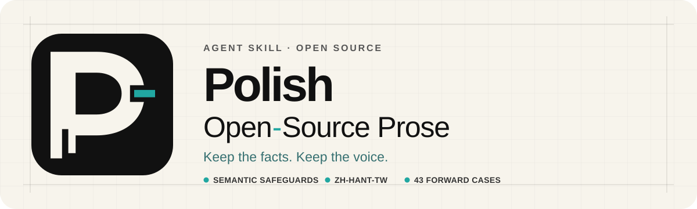

<p align="center">
  
</p>

<p align="center">
  <a href="README.md">English</a>
  ·
  <a href="#快速開始">快速開始</a>
  ·
  <a href="#語系支援">語系支援</a>
  ·
  <a href="CONTRIBUTING.md">參與貢獻</a>
</p>

<p align="center">
  <a href="https://github.com/ting-hong-shieh/polish-open-source-prose/actions/workflows/validate.yml"></a>
  
  
  
  
</p>

> 一套讓 agent 修改開源專案文字時「不改壞」的 skill：已經清楚的文字不動，事實、
> 命令、引文、授權與作者語氣保持原樣，也不替作者補上沒提供的事實。附台灣繁體中文
> 編輯層。可在 Claude Code 與 Codex 上執行。

<table>
  <tr>
    <td width="33%">
      <strong>清楚的文字不改</strong><br>
      被要求潤稿不代表一定要改。已經清楚的文字原樣交回。
    </td>
    <td width="33%">
      <strong>該精確的保持精確</strong><br>
      數字、條件、否定、命令、連結、引文、授權與刻意的語氣都不改寫。
    </td>
    <td width="33%">
      <strong>不捏造事實</strong><br>
      缺少的細節列成問題請作者補充，不自行編出數據、commit 或測試結果。
    </td>
  </tr>
</table>

## 快速開始

skill 目錄採用 [Agent Skills](https://agentskills.io) 格式，同一份檔案可以在
Claude Code 與 Codex 上使用。

### 使用 Claude Code 安裝

將這個 repository 加為 plugin marketplace，然後安裝 plugin：

```text
/plugin marketplace add ting-hong-shieh/polish-open-source-prose
/plugin install polish-open-source-prose
```

若不使用 plugin 系統，也可以直接複製 skill 目錄：

```bash
git clone https://github.com/ting-hong-shieh/polish-open-source-prose.git
cp -r polish-open-source-prose/skills/polish-open-source-prose ~/.claude/skills/
```

要讓 skill 只在單一專案生效，請改放到該專案的 `.claude/skills/`。

### 使用 Codex 安裝

呼叫 `$skill-installer`，並提出以下要求：

> 從這個 repository 的 `skills/polish-open-source-prose` 目錄安裝
> `polish-open-source-prose` skill：
> `https://github.com/ting-hong-shieh/polish-open-source-prose/tree/main/skills/polish-open-source-prose`

在本機開發期間，也可以直接使用 skill 目錄：

```text
skills/polish-open-source-prose
```

### 呼叫 skill

當要求符合 skill 的 description 時，Claude Code 會自動載入。也可以直接呼叫：

```text
/polish-open-source-prose
```

在 Codex：

```text
$polish-open-source-prose
```

可以從以下要求開始：

```text
稽核這份 README，只提出有證據支持的修改。

將這份 release note 在地化為 zh-Hant-TW，不要改變產品行為。

檢查這份 PR 說明是否有無依據聲明或遺失限定條件。
```

## 運作方式

1. **先決定要不要改。** 已經清楚、具體、符合場景的文字原樣交回。
2. **保護必須精確的內容。** 事實、限定詞、識別碼、命令、連結、引文、授權、政策
   文字、Markdown 結構與刻意的語氣。
3. **不補事實。** 刪掉或縮小沒有根據的主張；缺少的細節向作者提問，不自行填入。
4. **只在有具體代價時修改**，用最小的改動，交付前逐項比對原文。

被動句、排比、片段、設問、破折號或工整句型本身都不是問題。

## 為什麼 skill 這麼小

早期版本附了詞表、範例與各種文件場景的規則。用前向案例在 Claude Opus 5.5、
GPT-6.1 Sol 與 GPT-6 Astra 做 A/B 測試時，不載入 skill 的模型已經會刪掉宣傳語、
選對台灣用詞，卻幾乎把每段應該保持原樣的文字都改掉。較長的規則沒有改變改寫題的
結果；真正有差別的是「清楚的文字不改」和「必須精確的內容不動」這兩類規則。這個
版本在 Claude Opus 5.5 跑兩輪，19 個應保持不變的案例全部原樣交回；前一版是
13～14 個，不載入 skill 時是 0～3 個。

案例由維護者撰寫，並以子字串比對評分，所以這些數字只能當回歸訊號，不是 benchmark。

## 保護範圍

| 項目 | 範例 |
| --- | --- |
| 語意 | 主詞、範圍、比較、條件、例外、不確定性 |
| 證據 | 數字、日期、版本、引用來源、因果聲明 |
| 技術文字 | 命令、參數、API、識別碼、路徑、URL、錯誤字串 |
| 引文與規範 | 引文、引用、授權、政策、安全步驟 |
| 結構 | 標題、錨點、表格、清單、程式碼區塊、預留位置、frontmatter |
| 聲音 | 刻意的幽默、社群詞彙、語域與第一人稱立場 |

## 語系支援

| 語系 | 狀態 | 範圍 |
| --- | --- | --- |
| 所有語系 | 共通規則 | `SKILL.md` 的保真與修改規則 |
| `zh-Hant-TW` | 台灣編輯層 | 依語境選擇的詞彙、標點、法律文字、誤判防護與前向案例 |
| 其他語系 | 只有共通規則 | 仍需母語 locale pack 與審查 |

[Locale pack contract](docs/locale-pack-contract.md) 規定新增語言與地區時，
locale pack 需要包含的內容與測試方式。

## 邊界

本專案不會：

- 判定一段文字是人或模型寫的；
- 為了規避 AI 偵測器而改寫文字；
- 承諾移除統計浮水印；
- 捏造數據、產品行為、使用者故事、作者立場或個人經驗；
- 宣稱支援尚未建立並審查的語系；
- 取代法律、安全或專業領域審查。

需要證明作者來源時，skill 會建議簽署 canonical artifact，不把文風或統計浮水印
當成身分證明。

## 驗證

執行完整 repository 驗證：

```bash
python3 scripts/validate_repo.py
```

直接執行 skill 驗證：

```bash
python3 skills/polish-open-source-prose/scripts/validate_skill.py
```

目前有 49 個前向規格：19 個案例應保持不變，30 個案例應修改、提出檢查意見或提供
來源證明建議。
結構檢查可以找出受保護內容漂移與案例格式錯誤，但真實專案文字仍需母語使用者
審查。

<details>
<summary><strong>Repository 目錄</strong></summary>

```text
.
├── .claude-plugin/
│   ├── plugin.json
│   └── marketplace.json
├── .codex-plugin/plugin.json
├── docs/
│   ├── assets/
│   └── locale-pack-contract.md
├── scripts/validate_repo.py
└── skills/
    └── polish-open-source-prose/
        ├── SKILL.md
        ├── agents/openai.yaml
        ├── references/
        ├── scripts/
        └── tests/
```

每個平台各自讀取自己的 manifest 目錄與共用的 `skills/`，因此新增平台不會讓
編輯內容產生分支。

給使用者看的 repository 文件放在 skill 目錄外，避免它們被當成 agent 指令載入。

</details>

## 參與貢獻

提出廣泛編輯規則或新 locale 前，請先閱讀
[CONTRIBUTING.md](CONTRIBUTING.md)。特別有幫助的貢獻包括：

- 誤判案例；
- 缺少的語意保護；
- 依語境處理的地區詞彙；
- 可以重新散布的範例；
- 平衡的「應修改／不應修改」前向案例；
- locale pack 的母語審查。

## 授權與致謝

本 repository 的原創貢獻採 Apache-2.0。源自 `hardikpandya/stop-slop` 的內容
仍依 MIT 授權。詳情請見
[THIRD_PARTY_NOTICES.md](THIRD_PARTY_NOTICES.md) 與
[LICENSE.stop-slop](skills/polish-open-source-prose/LICENSE.stop-slop)。

設計過程參考了
[stop-slop](https://github.com/hardikpandya/stop-slop)、
[speak-human-tw](https://github.com/Raymondhou0917/speak-human-tw)、
[Humanizer-zh-TW](https://github.com/kevintsai1202/Humanizer-zh-TW)、
[humanizer-zh-tw](https://github.com/nagameTW/humanizer-zh-tw) 與
[Humanizer-zh-TW-Pro](https://github.com/slivenred/humanizer-zh-TW-Pro) 的公開成果。
